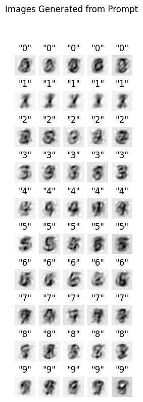

# Linear Diffusion

A Python Library for experimenting with a minimal implementation of a Diffusion model using entirely linear components.

## Design

Linear Diffusion is an attempt to explore the performance of essentially the minimum viable [Diffusion Model](https://lilianweng.github.io/posts/2021-07-11-diffusion-models/), such as [Dall-E 2](https://openai.com/product/dall-e-2) and [Stable Diffusion](https://stability.ai/blog/stable-diffusion-v2-release).

These models represent the current state of the art both in terms of performance and their immense complexity. 
Linear Diffusion aims to be to Diffusion Models what Logistic Regression is to Large Convolutional Neural 
Networks. One of my personal favorite bench marks is that Logistic Regression, often dismissed by 
data scientists as "just" a linear model is able to achieve > 90% accuracy on the MNIST data set. 
While this is far from state of the art, it is much better than many people naively guess.

Diffusion models can be broken down into 3 major parts:

- An image encoder, typically a *Variational Autoencoder*
- A text embedder which creates vector representation of the target text, often a *Transformer* or similar style *LLM*
- A denoiser that predicts noise in the image given a caption represented by the text embedder, typically a *Denoising UNET*

For those familiar with current work in deep learning, what makes diffusion models so impressive and complex is that each 
of these components itself is a very sophisticated neural network performing powerful non-linear transformations.

Clearly it is impossible for Linear Models to achieve anything like this! Or is it?

The goal of this project is to replace each of these parts with a simple, linear model and see if we can even replatic
the most rudimentary task of a transformer. The simple challenge is:

> from a simple language of only single digits, can we generate passable images of digits?

I don't expect to use linear models to create an Astronaut Riding a Horse, but these results are pretty cool:



The architecture of Linear Diffusion consists of these linear components:

- PCA for image encoding
- One-Hot encoding for "text"
- Multi-linear regression to denoise

Given only these simple components LinearDiffusion is able to do a surprising job of creating a purely linear generative model!

## Install

To Do

## Usage

Currently, it is assumed that Linear Diffusion will be used exclusively to play around with MNIST digits,
though it should be possible to play around with other (square) image data sets.

Here is a basic example case:

```python
import mnist
import numpy as np
from lineardiffusion import LinearDiffusion

# setup the training data
train_imgs = mnist.train_images()
test_imgs = mnist.test_images()
all_imgs = np.concatenate([train_imgs, test_imgs])

all_labels = [str(val) for val in np.concatenate([mnist.train_labels(), mnist.test_labels()])]


ld = LinearDiffusion()
ld.fit(all_labels, all_imgs)
```


The prediction will take a list of "text" (the only "language" the model knows is of single digits), and output a vector
images maxtrices.

The code used to generate the image above looks like this:

```python
import matplotlib.pyplot as plt

rows=10
cols=5
fig, ax = plt.subplots(rows,cols,facecolor='white', figsize=(3,9))

test_labels = list(chain.from_iterable([[str(i)]*5 for i in range(10)]))

# here's our prediction!
test_images = ld.predict(test_labels,seed=137)

for i in range(rows*cols):
    ax[i//cols][i%cols].imshow(test_images[i],
          cmap='gray_r')
    ax[i//cols][i%cols].axis('off')
    ax[i//cols][i%cols].set_title(f"\"{test_labels[i]}\"")
fig.suptitle("Images Generated from Prompt")
```

This code was just made as a quick demo so there are undoubtably many, many bugs and any deviation from this basic 
behavior will likely break things.